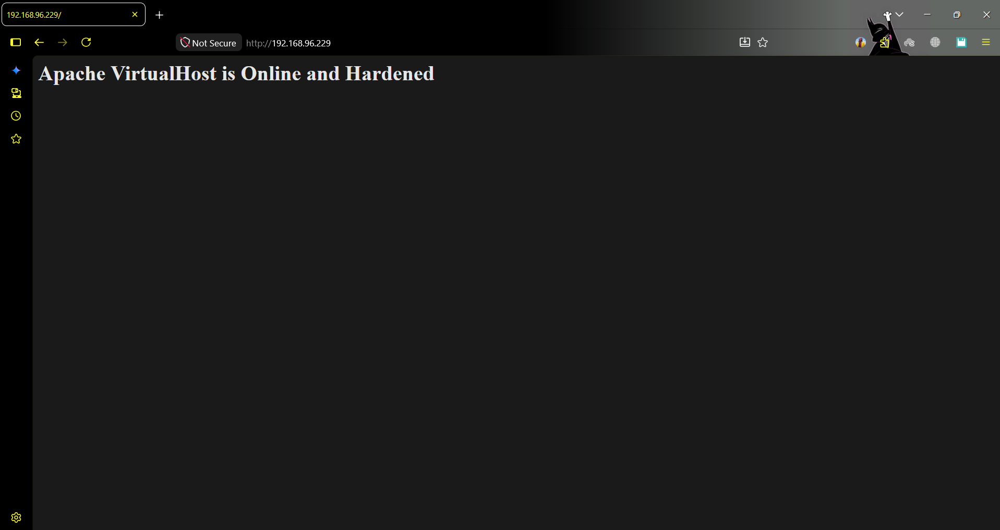
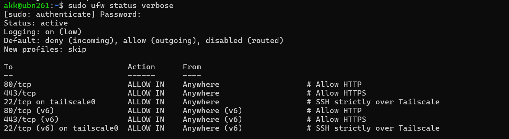

 # 🛡️ Production-Grade Hardened Linux Web Server

An enterprise-grade, secured Linux Web Server deployed on **Ubuntu Server** in a virtualized **VMware Workstation (Bridged Mode)** environment. Engineered strictly following **Defense-in-Depth** and **Zero-Trust** architectural principles.

---

## 🏗️ Architecture Overview

```text
                            [ PUBLIC INTERNET / CLIENTS ]
                                          │
                                    Port 80 (HTTP)
                                          ▼
                            ┌───────────────────────────┐
                            │     UFW Firewall Layer    │ (Default Deny Ingress)
                            └─────────────┬─────────────┘
                                          │
                                          ▼
                            ┌───────────────────────────┐
                            │    Apache2 Reverse Proxy  │ (VirtualHost / Header Forwarding)
                            └─────────────┬─────────────┘
                                          │ Passes to 127.0.0.1:3000
                                          ▼
                            ┌───────────────────────────┐
                            │    Node.js / Express App  │ (Systemd Managed Daemon)
                            └───────────────────────────┘

───────────────────────────────────────────────────────────────────────────────

                            [ SECURE MANAGEMENT PLANE ]
                                          │
                              Encrypted WireGuard Mesh
                                          ▼
                            ┌───────────────────────────┐
                            │  Tailscale Tunnel (VPN)   │ (tailscale0 / 100.70.130.83)
                            └─────────────┬─────────────┘
                                          │
                                    Port 22 (SSH)
                                          ▼
                            ┌───────────────────────────┐
                            │ Fail2Ban + Hardened SSHD  │ (Ed25519 Keys Only / Auto-Ban)
                            └───────────────────────────┘
```

📊 Project Roadmap & Progress (100% Complete)

    Phase 1: Static IP Configuration via Netplan

    Phase 2: SSH Hardening (Key-Based Authentication Only)

    Phase 3: Tailscale Encrypted Mesh VPN Setup

    Phase 4: Apache2 Web Server & VirtualHost Configuration

    Phase 5: UFW Firewall Hardening (Zero-Trust / Interface-bound)

    Phase 6: Fail2Ban Intrusion Prevention System

    Phase 7: Node.js Application with Apache Reverse Proxy

🚀 Phase 1: Static IP Configuration (Netplan)

    Objective: Converted guest OS from dynamic DHCP to deterministic static IP addressing.

    Config Applied: /etc/netplan/*.yaml using networkd renderer.

        Interface: ens33

        Static IP: 192.168.96.229/23

        Gateway: 192.168.96.1

    Evidence: valid_lft forever verified via ip addr show.


🔐 Phase 2: SSH Hardening & Key-Based Authentication

    Objective: Eradicated password authentication vectors by restricting access exclusively to Ed25519 cryptographic keys.

    Config Applied: /etc/ssh/sshd_config.d/99-hardened.conf

        PubkeyAuthentication yes

        PasswordAuthentication no

        PermitRootLogin prohibit-password

        MaxAuthTries 3

    Evidence: Connection attempts using password-only auth rejected with Permission denied (publickey).


🌐 Phase 3: Tailscale Encrypted Mesh VPN Tunnel

    Objective: Established peer-to-peer encrypted WireGuard mesh VPN between management workstation and server.

    Config Applied: Tailscale daemon initialized on interface tailscale0.

        Assigned Overlay IP: 100.70.130.83

    Evidence: Verified bidirectional mesh reachability via tailscale ping and SSH sessions over overlay IP.


🌐 Phase 4: Apache2 Web Server & VirtualHost

    Objective: Deployed Apache HTTP server with dedicated document root and proxy modules.

    Config Applied: Activated proxy, proxy_http, headers, and rewrite modules. Configured VirtualHost at /etc/apache2/sites-available/app.conf.

    Evidence: Configuration passed validation (Syntax OK) and served content from /var/www/site/public_html.


🔥 Phase 5: UFW Firewall Hardening (Zero-Trust Model)

    Objective: Enforced default-deny ingress posture with interface-bound rule restrictions.

    Config Applied:

        Default: deny incoming, allow outgoing

        Public Ports: 80/tcp & 443/tcp open to all

        Management Port: 22/tcp (SSH) strictly restricted to interface tailscale0 (LAN connections dropped).


🚫 Phase 6: Fail2Ban Intrusion Prevention System

    Objective: Real-time telemetry monitoring to prevent SSH brute-force floods.

    Config Applied: /etc/fail2ban/jail.local

        Backend: systemd journal monitoring

        Threshold: 3 failed attempts within 10 minutes triggers 24-hour firewall ban.


⚡ Phase 7: Node.js (via NVM) & Apache Reverse Proxy

    Objective: Internalized Node.js backend application behind Apache reverse proxy architecture.

    Implementation Details:

        Node.js LTS installed via non-root NVM.

        Express.js sample application listening strictly on loopback interface 127.0.0.1:3000.

        Application daemonized with systemd unit service (node-app.service) ensuring auto-recovery.

        Apache VirtualHost configured with ProxyPass and ProxyPassReverse forwarding client headers.

    Evidence: HTTP query to port 80 successfully served JSON payload from Node.js with Apache header verification.

![Image](screenshots/07-reverse-proxy-curl.png
